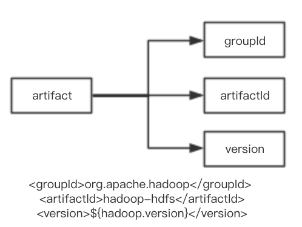
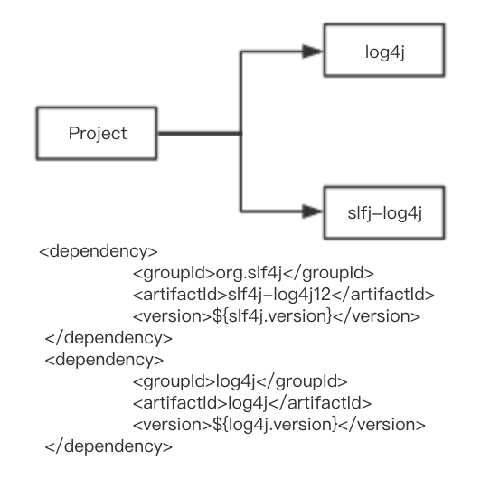

### 1、传统开发回顾

1. 收集依赖到classpath
1. 编写源代码、配置消息
1. javac编译
1. 单元测试
1. 产品打包、发布版本
1. 代码共享、存储以及版本控制

> 经常遇到编写代码jar包冲突、无法达到自动化版本构建和管理

### 2、maven介绍

1. 是一个项目构建工具
    1. 高度自动化
    1. 跨平台
    1. 丰富的课重用组件
    1. 标准化
    1. 一站式完成项目的**清理**、**编译**、**测试**、**报告**、**打包**、**部署**
1. 是一个依赖管理工具
    1. 可以同时管理多个项目的依赖jar包，共同进行构建打包
1. 是一个平台拥有无线可能的平台
    1. 可以搭建本地私服
    1. 可以使用免费私服
    1. 可以使用中央仓库
    1. 可以使用开源的maven插件和编写自定义插件
    1. 多元化管理、配置、搭建管理项目开发中的依赖

常用命令如下：

> mvn clean、mvn compile、mvn package、mvn install、mvn deploy

### 3、maven部署

#### 3.1、下载安装包

下载地址：https://maven.apache.org/download.cgi

目前版本：3.5.3

---

#### 3.2、window环境安装

首选确定系统已经安装了jdk1.8以上

将下载好maven压缩包解压到任意一个盘的根目录中，例如：d:\hadoopLearning\apache-maven-3.5.3

#### 3.3、配置环境变量

打开控制面板 -> 系统与安全 -> 系统 -> 高级系统设置 -> 环境变量，在系统变量区域新增如下

1. M2_HOME=安装的目录
1. 在PATH中增加%M2_HOME%\bin
1. MAVEN_OPTS=-Xms128m Xmx1024m(非必填，为了防止内存溢出)

#### 3.4、检查安装正确性

在cmd命令窗口中执行

```shell
#!/bin/bash
mvn -v
```
能够看到maven和jdk相关的版本号

---

#### 3.5、centos系统安装

首选确定系统已经安装了jdk1.8以上

将下载好maven压缩包解压到任意一个盘的根目录中，例如：/home/hadoopLearning/apache-maven-3.5.3，建议在当前的maven安装的同级目录创建软连接，方便后续使用

```shell
#!/bin/bash
ln -s /home/hadoopLearning/apache-maven-3.5.3 apache-maven
```

#### 3.6、配置环境变量

然后在环境变量中配置M2_HOME的路径，并配置PATH，具体配置如下：

```shell
#!/bin/bash

vim /etc/profile

# MAVEN
export MAVEN_HOME=/home/hadoopLearning/apache-maven-3.5.3
export PATH=$MAVEN_HOME/bin:$MAVEN_HOME/sbin:$PATH

:wq(退出保存)

source /etc/profile
```

#### 3.7、检查安装正确性

在centos命令窗口中执行

```shell
#!/bin/bash
mvn -v
```
能够看到maven和jdk相关的版本号

### 4、maven安装目录分析

1. bin    包含maven运行的脚本，用来配置java命令，准备配置classpath
1. boot   包含一个类的加载器框架
1. conf   包含setting.xml，全局配置maven的行为
1. lib    包含maven运行需要的一些列jar包

### 5、maven之pom初始

#### 5.1、构件

**构件及Artifact**

Artifact是工程将要产生或者需要的文件，可能是jar文件，源文件，二进制文件，war文件，甚至可能是pom文件，
每个artifact有artifactId、groupId和version组成唯一的表示



**依赖构件**

maven中一般都有多个构件，可以通过pom.xml的dependency元素进行指定配置



#### 5.2、插件


#### 5.3、生命周期

#### 5.4、仓库


### 6、maven之小试牛刀