### 1、Maven构件的版本

**版本号定义约定**

<主版本>.<次版本>.<增量版本>-<里程碑版本>

1. 主版本：是从1开始的整数，表示重大的项目结构和概念调整，一般不会轻易修改版本号，不同的版本
会不相同
1. 次版本：是从0开始的整数，表示项目的功能增加但是架构没有变化，同一个[主版本]下的不同副版本
是能向下兼容的
1. 增量版本：是从0开始的整数，重大的BUG修复
1. 里程碑版本：指某一个版本号里面的里程碑，如alpha-1,beta-1表示不稳定的发布版本，往往是需要去
测试的，又如snapshot、release分别表示开发中的快照版和稳定版

比如：

不稳定版本：1.0.0-beta-1

快照版本：1.0.0-SNAPSHOT

发布版本：1.0.0-RELEASE

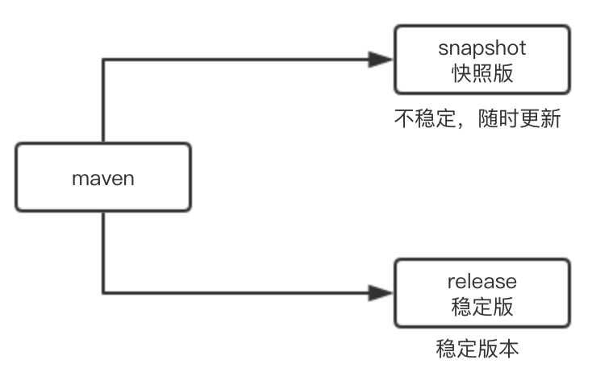

>当快照更新至稳定后，才改为一个发布版本

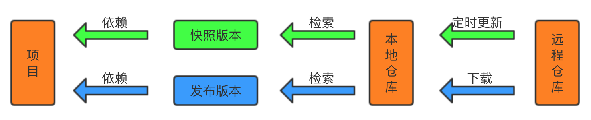

>如何确定快照版本是最新的？一个构件在对应的元数据文件中有相应的记录，而一个快照版本有时间戳，
通过检查本地仓库对应的元数据文件的快照构件时间戳远程仓库构件的时间戳来确定是否为最新的版本

### 2、Nexus内置仓库

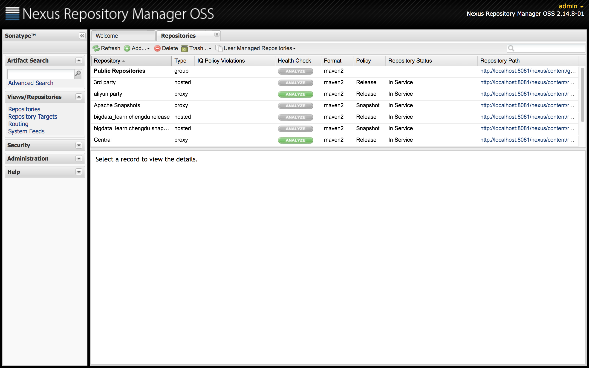

**其中**

1. 宿主仓库host
    1. release：本地已发布的构件，插件的版本
    1. snapshot：本地发布的快照版本
    1. 3td part：第三方构件，如oracle，db2等构件
1. 代理仓库proxy
    1. 第三方公共库：如central、jboss库，将远程的仓库缓存在本地，加快构件的下载
1. 仓库组
    1. public：可以将多个库组织在一起对外提供统一的地址进行引用

**私服仓库**

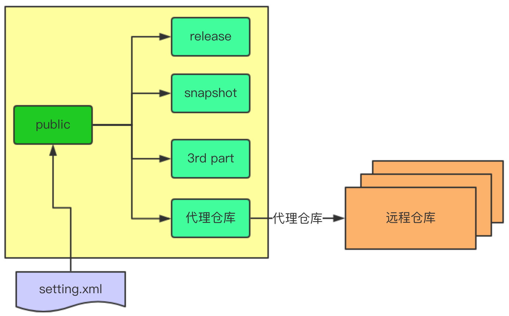

**默认的内置仓库**

1. central：该仓库代理maven的中央仓库，策略是release，只会下载和缓存中央仓库中的发布版本构件
1. release：策略为release的宿主类型仓库，用来部署组织内部的发布版本构件
1. snapshot：策略为snapshot的宿主类型仓库，用来部署组织内部快照版本构件
1. 3rd part：策略是release的宿主类型仓库，用来部署无法从公共仓库获得的第三方不发布的构件
1. apache snapshots：代理apache的快照版本构建
1. public repositories：该仓库将上述的所有仓库聚合合并进行统一的地址进行对外提供服务

### 3、Nexus仓库分类概念

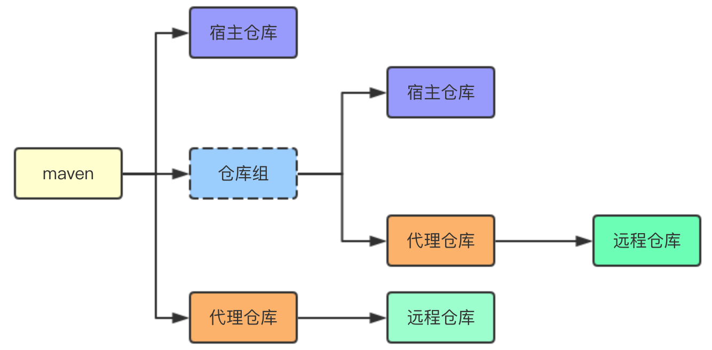

### 4、Nexus仓库的创建

**宿主仓库**

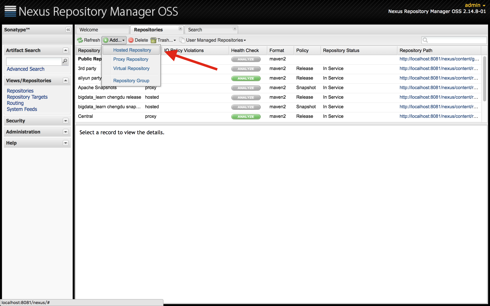

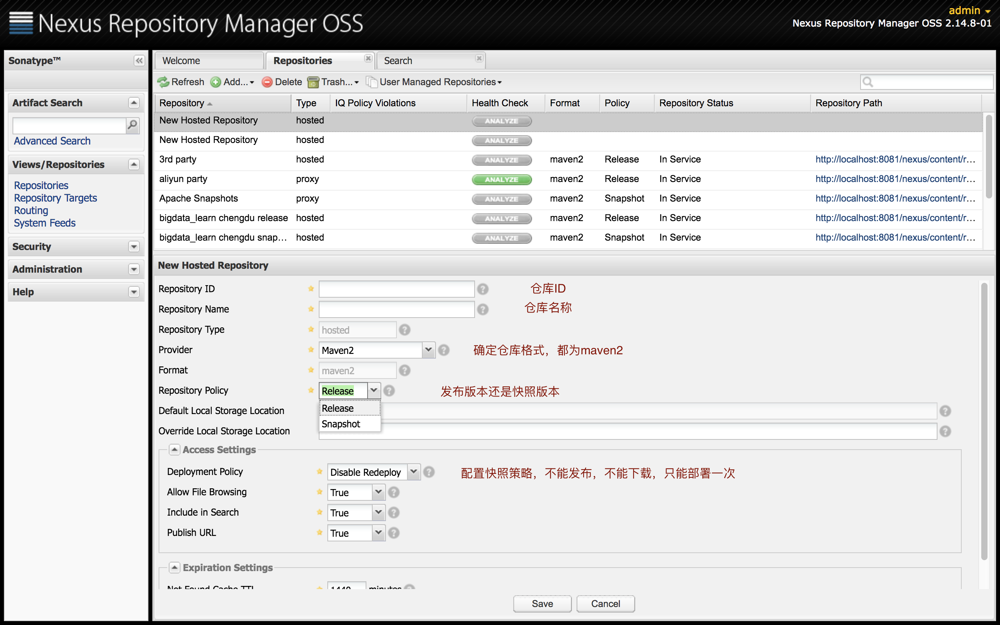

**代理仓库**

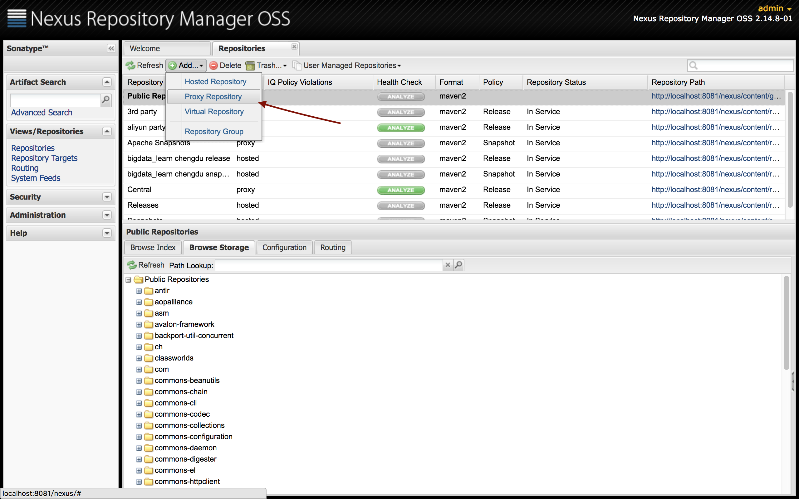

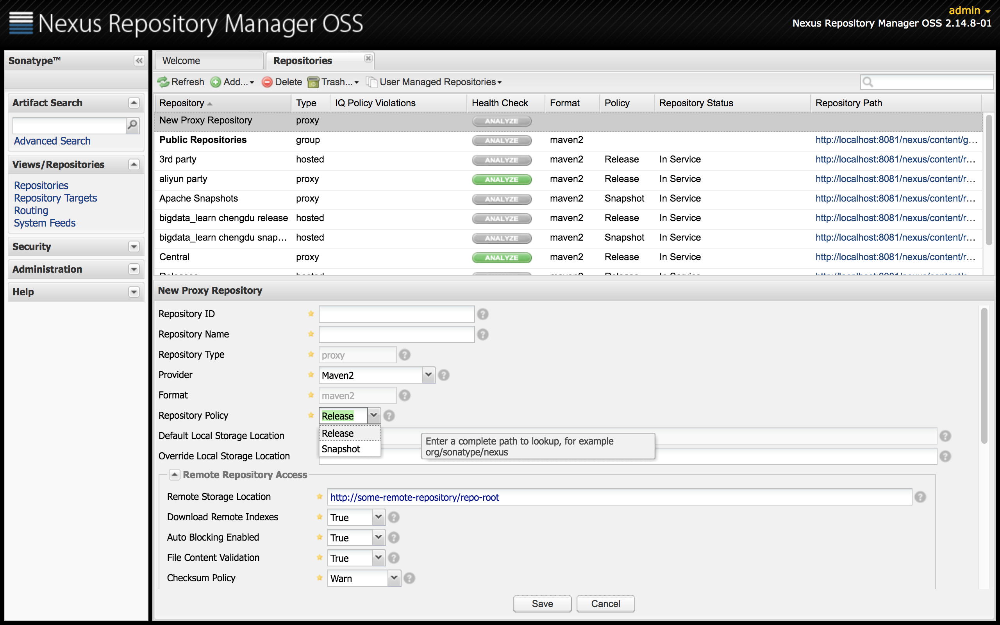

**仓库组**

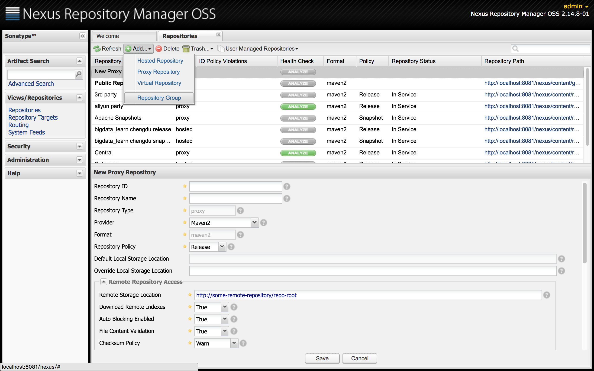

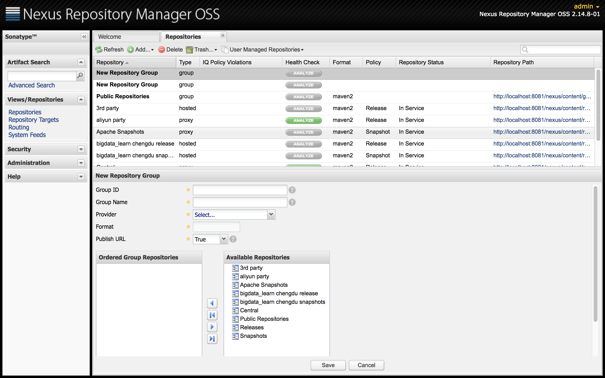

### 5、Maven基于Nexus私服下载

**针对某个pom.xml文件进行下载**

```xml
<properties>
        <distribution.url.prefix>http://127.0.0.1:8081</distribution.url.prefix>
</properties>
<!--配置依赖包仓库地址-->
<repositories>
    <repository>
        <id>public</id>
        <url>${distribution.url.prefix}/nexus/content/groups/public/</url>
        <layout>default</layout>
        <!--稳定版本-->
        <releases>
            <!--是否可以下载-->
            <enabled>true</enabled>
            <!--
            更新策略
            daily：默认值每天检查一次
            never：从不检查
            always：每次构建都检查
            interval:x：每隔多少分钟检查
            -->
            <updatePolicy>never</updatePolicy>
            <!--
            校验策略
            warn：默认值，构建会输出警告信息
            fail：出错让构建失败
            ignore：忽略检查
            -->
            <checksumPolicy>fail</checksumPolicy>
        </releases>
        <!--快照版本-->
        <snapshots>
            <enabled>true</enabled>
            <updatePolicy>always</updatePolicy>
            <checksumPolicy>fail</checksumPolicy>
        </snapshots>
    </repository>
</repositories>
<!--配置maven插件仓库地址-->
<pluginRepositories>
    <pluginRepository>
        <id>public</id>
        <url>${distribution.url.prefix}/nexus/content/groups/public/</url>
        <layout>default</layout>
        <snapshots>
            <enabled>true</enabled>
        </snapshots>
        <releases>
            <enabled>true</enabled>
        </releases>
    </pluginRepository>
</pluginRepositories>
```

**针对所有项目setting.xml**

```xml
<profiles>
    <profile>
      <!--默认直接屏蔽默认的仓库地址，不需要再去中央差仓库进行下载-->
      <id>central</id>
      <repositories>
        <repository>
          <id>public_jar</id>
            <url>http://localhost:8081/nexus/content/groups/public/</url>
            <layout>default</layout>
            <releases>
                <enabled>true</enabled>
                <updatePolicy>never</updatePolicy>
                <checksumPolicy>fail</checksumPolicy>
            </releases>
            <snapshots>
                <enabled>true</enabled>
                <updatePolicy>always</updatePolicy>
                <checksumPolicy>fail</checksumPolicy>
            </snapshots>
        </repository>
      </repositories>
      <pluginRepositories>
        <pluginRepository>
            <id>public_maven</id>
            <url>http://localhost:8081/nexus/content/groups/public/</url>
            <layout>default</layout>
            <snapshots>
                <enabled>true</enabled>
            </snapshots>
            <releases>
                <enabled>true</enabled>
            </releases>
        </pluginRepository>
      </pluginRepositories>
    </profile>
</profiles>

```

### 6、Maven基于Nexus私服部署

**针对某个项目pom.xml**

```xml
<properties>
    <distribution.url.prefix>http://127.0.0.1:8081</distribution.url.prefix>
</properties>
<!-- 发布管理 -->
<distributionManagement>
    <!--注意release和snapshot的上传书写方式-->
    <repository>
        <id>bigData-releases</id>
        <name>liumm-releases</name>
        <url>${distribution.url.prefix}/nexus/content/repositories/chengdu_release/</url>
    </repository>
    <snapshotRepository>
        <id>bigData-snapshots</id>
        <name>liumm-snapshots</name>
        <url>${distribution.url.prefix}/nexus/content/repositories/chengdu_snapshots/</url>
    </snapshotRepository>
</distributionManagement>
```

> 注意：如果单独写在pom.xml中，执行 mvn deploy 会出现权限异常，需要在setting.xml配置权限

```xml
<servers>
    <server>
      <!--此处的id要与项目中pom的distributionManagement对应仓库的id对应-->
      <id>bigData-releases</id>
      <username>admin</username>
      <password>admin123</password>
    </server>
    <server>
      <id>bigData-snapshots</id>
      <username>admin</username>
      <password>admin123</password>
    </server>
</servers>

```


### 7、Maven镜像

### 8、Nexus权限管理