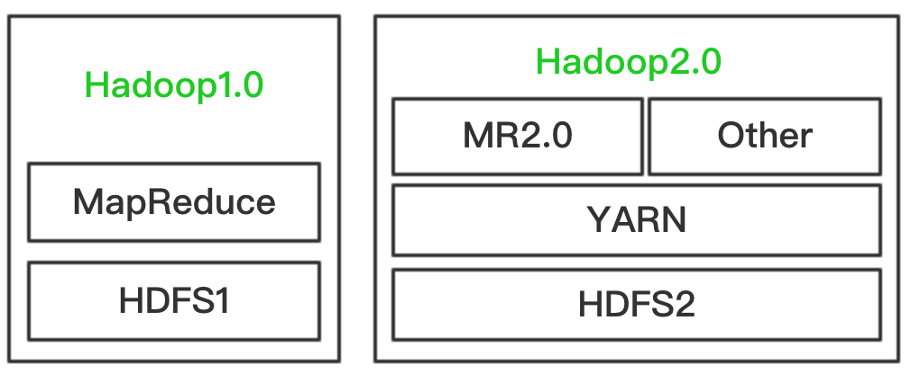
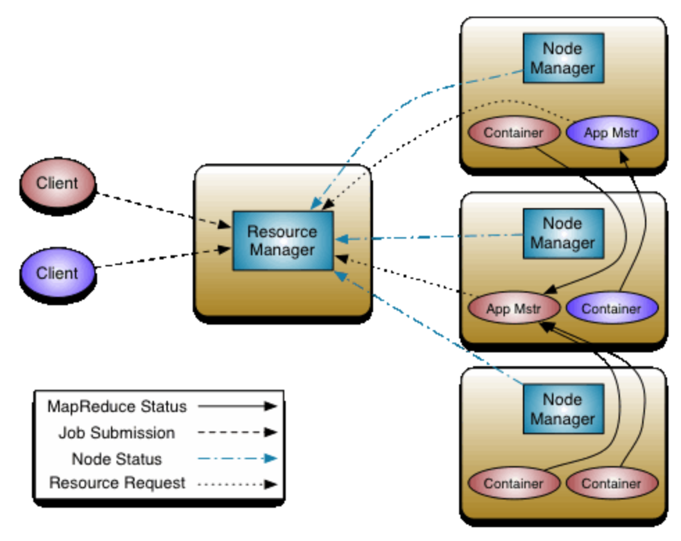

### 1、yarn引言

**hadoop2.0**是由HDFS、MapReduce、Yarn三个分支组成

1. hdfs:支持NNfederation、HA
1. MapRedcue:运行在yarn之上的mr，编程模型不变
1. yarn:资源管理系统

### 2、yarn产生背景

**直接源于mr1在几方面的无能**

1. 扩展性差，jobTracker成为瓶颈和难以支持其他的计算框架
1. 可靠性差，namenode的单点故障
1. 服务器资源不能有效进行利用

**多计算框架各自为政，数据共享困难**

1. MR：离线计算框架
1. Storm：实时计算框架
1. Spark：内存计算框架

### 3、yarn的基本框架与组件

Yarn主要由以下几个组件组成：

1. ResourceManager：Global（全局）的进程 
1. NodeManager：运行在每个节点上的进程
1. ApplicationMaster：Application-specific（应用级别）的进程
1. Scheduler：是ResourceManager的一个组件
1. Container：节点上一组CPU和内存资源

Container是Yarn对计算机计算资源的抽象，它其实就是一组CPU和内存资源，所有的应用都会运行在Container中。ApplicationMaster是对运行在Yarn中某个应用的抽象，它其实就是某个类型应用的实例，ApplicationMaster是应用级别的，它的主要功
能就是向ResourceManager（全局的）申请计算资源（Containers）并且和NodeManager交互来执行和监控具体的task。Scheduler是ResourceManager专门进行资源管理的一个组件，负责分配NodeManager上的Container资源，NodeManager也会不断发
送自己Container使用情况给ResourceManager。

ResourceManager和NodeManager两个进程主要负责系统管理方面的任务。ResourceManager有一个Scheduler，负责各个集群中应用的资源分配。对于每种类型的每个应用，都会对应一个ApplicationMaster实例，ApplicationMaster通过和
ResourceManager沟通获得Container资源来运行具体的job，并跟踪这个job的运行状态、监控运行进度。

Yarn的架构图： 

### 4、yarn的架构与组件

**Container**

1. 具体执行应用task（如map task、reduce task）的基本单位
1. 一个节点会运行多个Container，但一个Container不会跨节点。
1. 任何一个job或application必须运行在一个或多个Container中
1. ResourceManager只负责告诉ApplicationMaster哪些Containers可以用，ApplicationMaster还需要去找NodeManager请求分配具体的Container。

**Node Manager**

1. 单个节点上的资源管理
1. 处理来自ResourceManager
1. 处理来自ApplicationMaster

**Resource Manager**

1. 处理客户端的请求
1. 启动和监控ApplicationMaster
1. 监控NodeManager
1. 资源分配与调度

**Application Master**

1. 数据切分
1. 为应用程序申请资源、并分配给内部任务
1. 任务监控与容错

### 5、yarn的作业基本处理流程

1. 提交作业
1. 通知NM启动第一个container
1. NM在Container中启动ApplicationMaster
1. 向RM注册并请求计算资源
1. 获取计算资源信息后通知NM启动Container
1. NM启动Container并允许任务

### 6、yarn的调度框架

**双层调度框架**

1. ResourceManager将资源分配给ApplicationMaster
1. ApplicationMaster将资源进一步分配给各个Task

**基于资源预留的计算调度策略**

1. 资源不够时，回为task预留，直到资源充足
1. 与 "all or nothing" 策略不同（Apache Mesos）

### 7、运行在yarn之上的计算框架

1. 离线计算框架：MapReduce
1. DAG计算框架：Tez
1. 流式计算框架：Strom
1. 内存计算框架：Spark
1. 图计算框架：Giraph、GraphLib

### 8、yarn带来的好处

1. 一个集群可以部署多个版本的计算框架
1. 计算资源按需申请，动态伸缩
1. 不同负载应用混搭，集群利用率高
1. 共享底层存储，避免数据跨集群迁移

### 9、yarn处理mr2流程